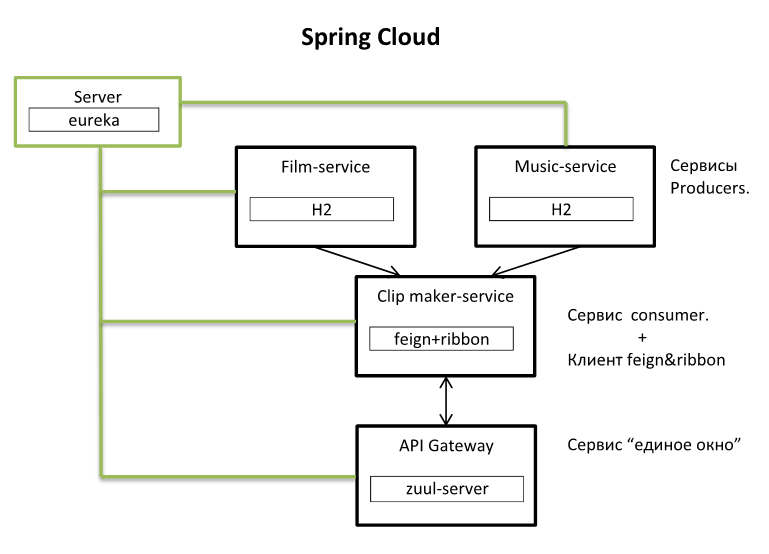

## Технологии

<ul>
    <li>Netflix Eureka</li>
    <li>Netflix Ribbon</li>
    <li>Netflix Zuul</li>
    <li>OpenFeign</li>
    <li>Spring Data JPA</li>
    <li>H2</li>
    <li>Spring Web</li>
    <li>Spring Boot</li>
    <li>Maven 3.6.1</li>
    <li>JDK 11 ver.</li>
</ul>

## Иллюстрация

  

## Описание микро-сервисов

<ul>
    <li><code>film-service</code> и <code>music-service</code> сервисы producer'ы. Они выдают фильм и музыку,
        которая использовалась в данном фильме.</li>
    <li><code>clipmaker-service</code> является сервисом consumer'ом, который использует данные сервисов 
        producer'ов. Т.е. он делает клип из фильма и песни, написанной специально для этого фильма. Клип соответственно 
         имеет продолжительность равной продолжительности песни. Кроме того, данный сервис является feign и ribbon
         клиентом.</li>
    <li><code>zuul-service</code> API Gateway сервер, позволяющий составлять запросы как от consumer'а так и от
        producer'ов. В своём вроде он чем-то похож как на "единое окно".</li>
    <li><code>server</code> сервер, который связывает все микро-сервисы в единое "облако".</li>
</ul>

## Порядок запуска микро-сервисов

<ul>
    <li>1) ServerApplication</li>
    <li>2) MusicServiceApplication & FilmServiceApplication</li>
    <li>3) ZuulApplication</li>
    <li>4) ClipmakerApplication</li>
</ul>

##Взаимодействие с веб-службой

Через API Gateway (zuul server):----------------------------------------------------

Простые ссылки (надо копировать и вставлять в браузер):

[http://localhost:8765/eureka-client-clipmaker/clipmaker](http://localhost:8765/eureka-client-clipmaker/clipmaker) 
clipmaker-service

[--clip-maker: кликабельно](http://www.localhost:8765/eureka-client-clipmaker/clipmaker "www.localhost:8765/...")

[http://localhost:8765/eureka-client-music/music](http://localhost:8765/eureka-client-music/music)
 music-service

[http://localhost:8765/eureka-client-film/film](http://localhost:8765/eureka-client-film/film)
 film-service
 
 Ссылки напрямую с сервисами, без API Gateway (zuul server):------------------ [http://localhost:8761/](http://localhost:8761/) информационная страница сервера (Eureka)
 
 [http://localhost:8300/clipmaker](http://localhost:8300/clipmaker) clipmaker-service
 
 [http://localhost:8100/music](http://localhost:8100/music) music-service
 
 [http://localhost:8200/film](http://localhost:8200/film) film-service
 
 
 

